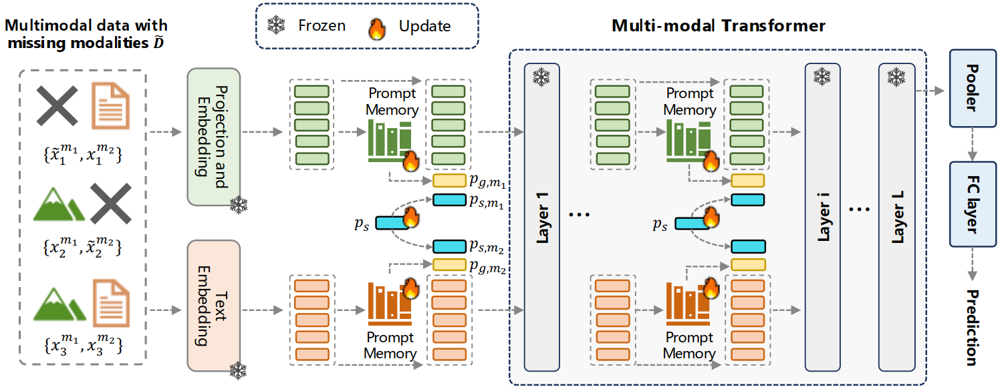

# Enhancing Multimodal Model Robustness under Missing Modalities via Memory-Driven Prompt Learning 
Codes for IJCAI 2025 paper "Enhancing Multimodal Model Robustness under Missing Modalities via Memory-Driven Prompt Learning".  


## Introduction
Existing multimodal models typically assume the availability of all modalities, leading to significant performance degradation when certain modalities are missing.
Recent methods have introduced prompt learning to adapt pretrained models to incomplete data, achieving remarkable performance when the missing cases are consistent during training and inference.
However, these methods rely heavily on distribution consistency and fail to compensate for missing modalities, limiting their ability to generalize to unseen missing cases.
To address this issue, we propose Memory-Driven Prompt Learning, a framework that adaptively compensates for missing modalities through prompt learning.
The compensation strategies are achieved by two types of prompts: generative prompts and shared prompts.
Generative prompts retrieve semantically similar samples from a predefined prompt memory that stores modality-specific semantic information, while shared prompts leverage available modalities to provide cross-modal compensation.
Extensive experiments demonstrate the effectiveness of the proposed model, achieving significant improvements across diverse missing-modality scenarios, with average performance increasing from 34.76\% to 40.40\% on MM-IMDb, 62.71\% to 77.06\% on Food101, and 60.40\% to 62.77\% on Hateful Memes.

<div align="center">
  
</div>

## Enviroment

Python = 3.7.13, Pytorch = 1.10.0,  CUDA = 11.3

```
pip install -r requirements.txt
```

## Prepare Dataset

We use three widely adopted vision-and-language datasets:[MM-IMDb](https://github.com/johnarevalo/gmu-mmimdb), [UPMC Food-101](https://visiir.isir.upmc.fr/explore), and [Hateful Memes](https://ai.facebook.com/blog/hateful-memes-challenge-and-data-set/).
Please check DATA.md for detailed instructions on how to organize the datasets.

To generate the pyarrow binary file, run the following command:

```
python make_arrow.py --dataset [DATASET] --root [YOUR_DATASET_ROOT]
```

Our data preprocessing follows the pipeline introduced in [Missing-Aware Prompts](https://github.com/YiLunLee/missing_aware_prompts).
For more details on data organization and formatting, we recommend referring to their repository.

## Training Instructions

To train the model on your selected dataset, please follow the steps below:

1. Download the pretrained ViLT model weights from the official [ViLT](https://github.com/dandelin/ViLT.git) repository.

2. Update the configuration files to match your local environment.
Choose the appropriate training task (e.g., `task_finetune_mmimdb`, `task_finetune_food101`, or `task_finetune_hatememes`)

3. Use the following command to start training:

``` 
python run.py with data_root=<ARROW_ROOT> \
        num_gpus=<NUM_GPUS> \
        num_nodes=<NUM_NODES> \
        per_gpu_batchsize=<BS_FITS_YOUR_GPU> \
        <task_finetune_mmimdb or task_finetune_food101 or task_finetune_hatememes> \
        load_path=<MODEL_PATH> \
        exp_name=<EXP_NAME> \    
```


## Evaluation Instructions

```
python run.py with data_root=<ARROW_ROOT> \
        num_gpus=<NUM_GPUS> \
        num_nodes=<NUM_NODES> \
        per_gpu_batchsize=<BS_FITS_YOUR_GPU> \
        <task_finetune_mmimdb or task_finetune_food101 or task_finetune_hatememes> \
        load_path=<MODEL_PATH> \
        exp_name=<EXP_NAME> \
        test_ratio=<TEST_RATIO> \
        test_type=<TEST_TYPE> \
        test_only=True        
```


## Citation
If you find this work useful for your research, please cite:
```Bibtex
@inproceedings{zhao2025enhancing,
 title = {Enhancing Multimodal Model Robustness under Missing Modalities via Memory-Driven Prompt Learning},
 author = {Yihan zhao and Wei xi and Xiao Fu and Jizhong Zhao},
 booktitle = {International Joint Conference on Artificial Intelligence (IJCAI)},
 year = {2025}
}

```

## Acknowledgements
This code is based on [ViLT](https://github.com/dandelin/ViLT.git) and [MAP](https://github.com/YiLunLee/missing_aware_prompts). Thanks for their contributions.
